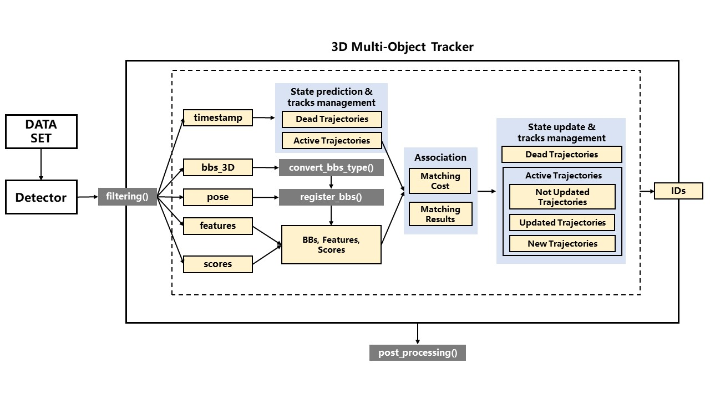

# 3D Multi-Object Tracker
This project is developed for tracking multiple objects in 3D scene. The visualization code is from
[here](https://github.com/hailanyi/3D-Detection-Tracking-Viewer).


## Features
* Fast: currently, the codes can achieve 700 FPS using only CPU (not include detection and data op), can perform tracking 
on all kitti val sequence in several seconds. 
* Support online, near online and global implementation. 
The overall framework of design is shown below:


## Kitti Results
**Car/Pedestrian** tracking results on the Kitti tracking val seq [1,6,8,10,12,13,14,15,16,18,19] 
using second-iou, point-rcnn and pv-rcnn detections. We also followed the **HOTA** metric, and tuned the parameters by first 
considering the **HOTA** performance. 

|Detector|online|near online (latency=2s)|global|
|:---:|:---:|:---:|:---:|
|point-rcnn|76.653|77.576|78.853|
|second-iou|77.29/48.011|78.17/50.362|78.799/51.20|
|pv-rcnn|78.289/49.662|79.48/50.824|80.075/51.753|

 Online: CA-based KF + greedy matching. 
 Near online: online + rescoring tracks in a temporal window.
 Global: online + rescoring tracks globally.
 
## Prepare data 
You can download the Kitti tracking pose data from [here](https://drive.google.com/drive/folders/1Vw_Mlfy_fJY6u0JiCD-RMb6_m37QAXPQ?usp=sharing), and
you can download the point-rcnn, second-iou and pv-rcnn detections from [here](https://drive.google.com/file/d/1zVWFGwRqF_CBP4DFJJa4nBcu-z6kpF1R/view?usp=sharing).

To run this code, you should organize Kitti tracking dataset as below:
```
# Kitti Tracking Dataset       
└── kitti_tracking
       ├── testing 
       |      ├──calib
       |      |    ├──0000.txt
       |      |    ├──....txt
       |      |    └──0028.txt
       |      ├──image_02
       |      |    ├──0000
       |      |    ├──....
       |      |    └──0028
       |      ├──pose
       |      |    ├──0000
       |      |    |    └──pose.txt
       |      |    ├──....
       |      |    └──0028
       |      |         └──pose.txt
       |      ├──label_02
       |      |    ├──0000.txt
       |      |    ├──....txt
       |      |    └──0028.txt
       |      └──velodyne
       |           ├──0000
       |           ├──....
       |           └──0028      
       └── training # the structure is same as testing set
              ├──calib
              ├──image_02
              ├──pose
              ├──label_02
              └──velodyne 
```
Detections
```
└── point-rcnn
       ├── training
       |      ├──0000
       |      |    ├──000001.txt
       |      |    ├──....txt
       |      |    └──000153.txt
       |      ├──...
       |      └──0020
       └──testing 
```

## Requirements
```
python3
numpy
opencv
yaml
```

## Quick start
* Please modify the dataset path and detections path in the [yaml file](./config/online/pvrcnn_mot.yaml) 
to your own path.
* Then run ``` python3 kitti_3DMOT.py config/online/pvrcnn_mot.yaml``` 
* The results are automatically saved to ```evaluation/results/sha_key/data```, and 
evaluated by HOTA metrics.

## Notes
The evaluation codes are copied from [Kitti](https://github.com/JonathonLuiten/TrackEval).
